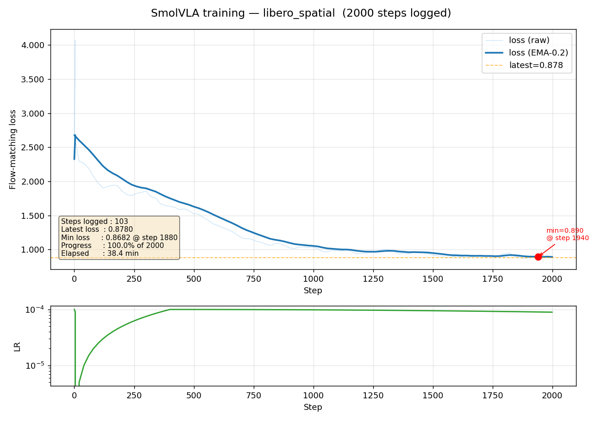
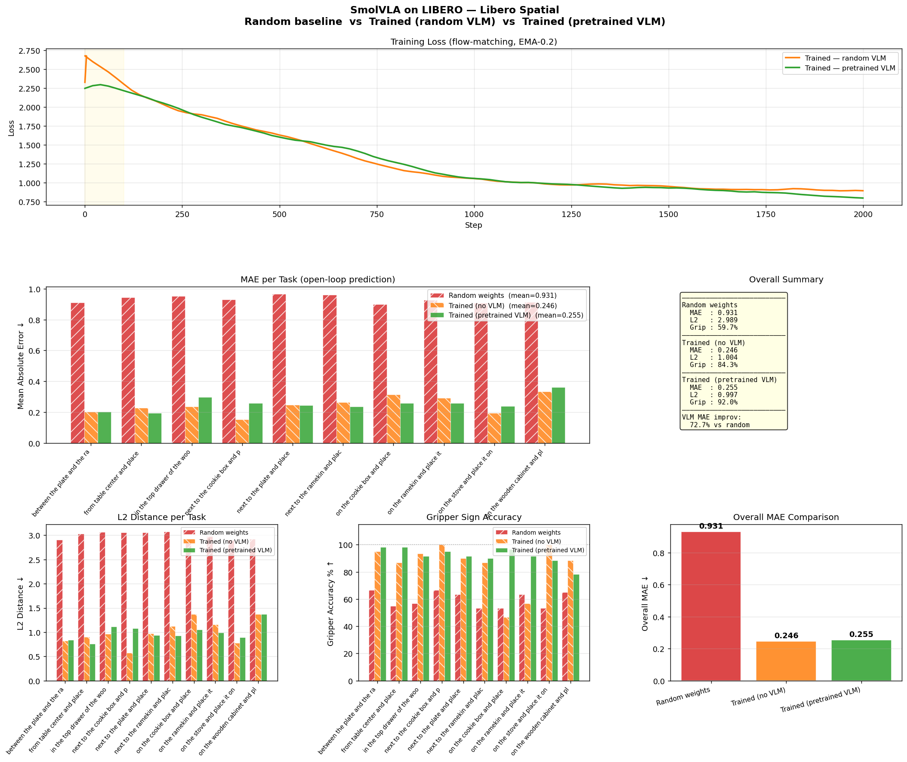
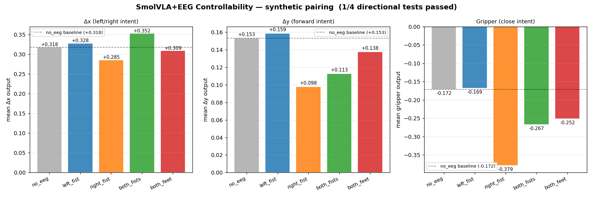
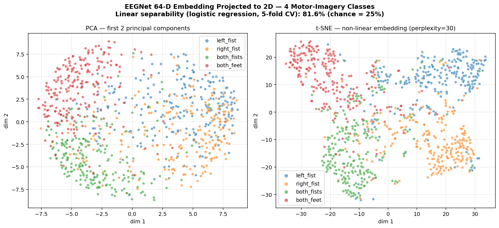
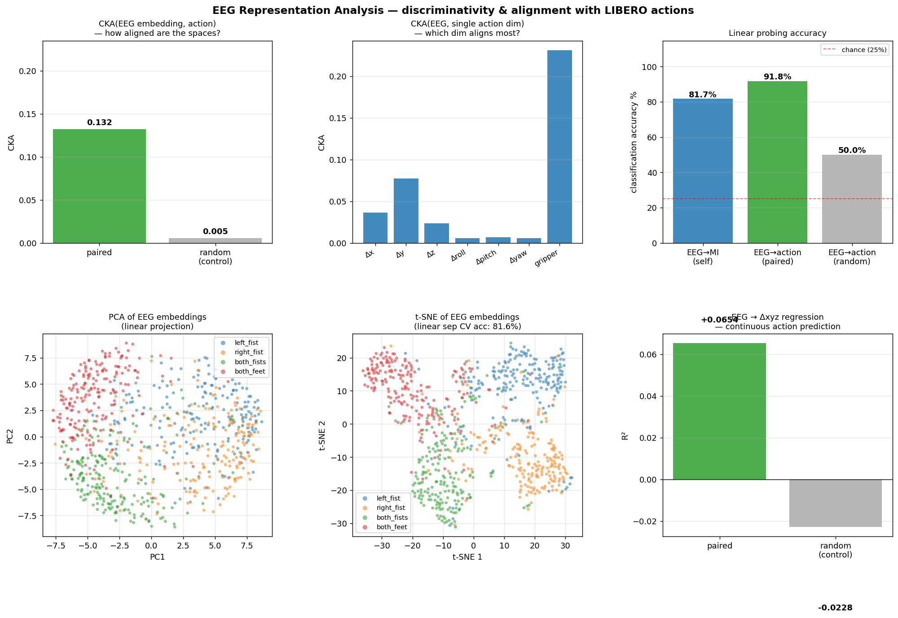
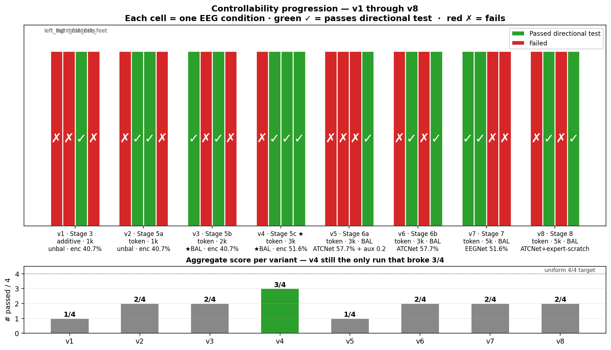

# SmolVLA + LIBERO + EEG 多模态机器人控制实验

Early-stage demonstration of [SmolVLA](https://huggingface.co/lerobot/smolvla_base) (Vision-Language-Action model) running on LIBERO robot arm simulation on a Mac (no NVIDIA GPU — uses Apple MPS), extended with EEG as a fourth input modality.

> **注意**：这个项目仅作为Architecture层面的demo。EEG模态的整合采用了简化的加法注入方式，**完全绕过了VLM**，直接在最末端对状态向量做加法调整。正确的做法是把EEG embedding投影到VLM的hidden dim，然后作为额外的token插入到SmolVLM2 transformer的输入序列中，让它和图像patch、语言token一起经过attention层。这样EEG才能在语义层面影响模型对场景的理解。下文阶段三和四的实验已实证地验证了这一判断。

整个项目分为四个阶段，逐步增加模态、验证可控性、并从representation learning层面分析EEG模态的可行性。

---

## 阶段一：LIBERO + lerobot 基础管线

建立从LIBERO机器人仿真环境到SmolVLA策略模型的完整数据流，并在LIBERO `libero_spatial` suite的500个示教数据上微调SmolVLA。

- **数据**：LIBERO `libero_spatial` 数据集（10任务 × 50演示 × ~120步），HDF5格式
- **模型**：SmolVLA（SmolVLM2-500M VLM backbone + flow-matching action expert）
- **训练**：2000步，effective batch=16，cosine LR schedule，VLM backbone冻结，仅训练action expert
- **评估**：开环动作预测 MAE / L2 / 夹爪准确率
- **代表脚本**：`train_smolvla_libero.py`、`eval_openloop.py`、`plot_eval.py`

### 训练曲线



Flow-matching loss 从初始的 ~2.7 降至最终 0.878（随机VLM backbone）。学习率经过100步warmup后进入cosine decay阶段。

### 评估对比



| 模型 | MAE ↓ | L2 ↓ | 夹爪准确率 ↑ |
|---|---|---|---|
| Random weights（基线） | 0.931 | 2.989 | 59.7% |
| Trained — random VLM | 0.246 | 1.004 | 84.3% |
| Trained — pretrained VLM | 0.255 | 0.997 | **92.0%** |


阶段一的核心是验证"在Mac MPS上能跑通完整的VLA训练管线"。两个关键发现：

1. **微调显著优于随机权重**：MAE降低73.5%，夹爪准确率从60%提升到84%以上，证明 action expert 确实学到了 LIBERO 的动作分布
2. **预训练VLM backbone带来夹爪精度的额外提升**：从84.3%到92.0%（+7.7pp）。这是因为预训练的SmolVLM2具备真实的视觉-语言理解，能从图像中识别"什么时候该抓握"。但translation维度（Δx, Δy, Δz）的MAE改善很小，说明预训练VLM主要帮的是语义判断（抓/放），而不是精细的运动学

---

## 阶段二：加入EEG数据作为第四模态

在阶段一的SmolVLA之上添加EEG脑电信号作为新的输入modality。EEG来自PhysioNet EEGMMIDB数据集（10个受试者，64通道，160Hz，4类运动想象任务）。

- **新数据**：PhysioNet 2秒EEG epochs（左拳/右拳/双拳/双脚想象）
- **新模型组件**：
  - EEGNet编码器（585K参数，depthwise-separable CNN）→ 64维embedding
  - 线性投影层（64→14维，900个新参数）
- **注入方式**：将EEG投影后的14维向量**加**到机械臂状态向量上
- **训练设置**：50% EEG dropout，EEG epoch随机配对（无真实pairing）
- **代表脚本**：`download_eeg_data.py`、`train_eeg_encoder.py`、`train_smolvla_eeg.py`、`eval_openloop_eeg.py`

### 评估结果（5种EEG条件）


| EEG条件 | 含义 | MAE | L2 | 夹爪 |
|---|---|---|---|---|
| no_eeg | 零脑电（基线） | 0.342 | 1.442 | 48.0% |
| left_fist | 想象握左拳 | 0.355 | 1.572 | 35.7% |
| right_fist | 想象握右拳 | 0.361 | 1.524 | 43.7% |
| both_fists | 想象双手握拳 | 0.323 | 1.381 | 54.3% |
| both_feet | 想象双脚用力 | 0.355 | 1.561 | 34.3% |


阶段二建立了EEG作为额外输入modality的完整管线，并测试模型在不同想象任务下的表现。但在这个阶段，**训练时EEG是随机采样的**（跟当前action完全无关），因此模型学不到任何"EEG → 动作"的对应关系。

5个条件之间的MAE差异（0.323~0.361）只测了30个demo，**完全在统计噪声范围内**。表面上看both_fists表现"最好"，但这无法证明模型真的在使用EEG信号——也可能是抽样偶然。

阶段二的真实贡献只是验证了管线可以运行，**没有证明EEG对动作生成有任何帮助**。要回答"EEG是否真的被模型利用"这个问题，必须做阶段三的对照实验。

---

## 阶段三：确定性EEG-动作配对 + 0% Dropout 可控性测试

为了排除"模型只是忽略EEG"的可能，强制制造确定性的EEG-动作语义配对，并把EEG dropout降到0%，让模型**必须**依赖EEG才能完成训练。

- **动作 → EEG类别的强制映射**：
  - delta_x < 0（向左移动） → 配对 `left_fist` 脑电
  - delta_x > 0（向右移动） → 配对 `right_fist`
  - gripper关闭 / 向后 → 配对 `both_fists`
  - delta_y > 0（向前） → 配对 `both_feet`
- **训练设置**：1000步，EEG dropout=0%，动作分类分布 L/R/F/Fwd ≈ 17/17/46/20%
- **测试**：固定相机/状态/语言输入，切换EEG条件，看模型输出的Δx、Δy、夹爪是否会按预期方向偏移
- **代表脚本**：`train_smolvla_eeg.py`（`SYNTHETIC_PAIRING=1`模式）、`eval_synthetic_eeg.py`

### 可控性测试结果



| EEG条件 | 期望偏移 | 实际偏移 | 通过 |
|---|---|---|---|
| left_fist | Δx 显著 < 0 | +0.010（几乎无变化） | ✗ |
| right_fist | Δx 显著 > 0 | −0.032（方向反了） | ✗ |
| both_fists | gripper 显著 < 0 | **−0.095**（方向对） | ✓ |
| both_feet | Δy 显著 > 0 | −0.016（方向反了） | ✗ |

**总体：1/4 通过**


这是项目中**最重要的科学结论**之一。即使在最理想的条件下（数据100%确定性配对、强制依赖EEG、训练1000步），模型在4个方向中只学会了1个——而且唯一通过的是gripper维度（二值信号，最容易被加法注入影响）。

这证明：

1. **架构层面就不可行**——问题不在数据缺乏，而在注入机制太浅。简单的"EEG → 14维向量 → 加到state上"无法让EEG信号真正参与决策
2. **Translation维度的失败**特别说明：连续的运动学信号被VLM主导的强信号淹没了
3. **gripper维度的成功**反而印证了上述判断——只有这个最简单、最离散的维度才能被弱注入信号影响

正确的做法是把EEG投影到VLM的hidden dim并作为token送入transformer，让它在attention层和图像、语言一起被深度融合。这是一个明确的架构改进方向。

---

## 阶段四：Representation Learning 综合分析

不再依赖端到端训练，而是直接对EEGNet学到的表征做严格的分析，验证三件事：(1) EEG表征本身是否discriminative；(2) EEG和action空间是否对齐；(3) EEG能否预测连续的机器人动作。

- **方法**：
  - **CKA**（Centered Kernel Alignment）：测量EEG embedding和action向量之间的表征空间相似度，对比synthetic pairing与random shuffle
  - **PCA / t-SNE**：把EEGNet的64维embedding投影到2D，看4个MI类别是否在latent space聚类
  - **Linear probing**：用线性分类器从EEG embedding预测MI类别和action类别，对比random baseline
- **代表脚本**：`analyze_representations.py`、`plot_eeg_embedding_2d.py`

### EEG Embedding 的 2D 可视化



EEGNet 的 64 维 embedding 投影到 2D 空间。两个图分别用 PCA（线性投影）和 t-SNE（非线性投影）。**4 个 MI 类别在 t-SNE 中清晰分开**，证明 EEGNet 确实学到了 discriminative features。线性可分性（5-fold CV logistic regression）：**81.6%**（chance=25%）。

### 综合分析图



### 关键数值

| 指标 | 数值 | 解读 |
|---|---|---|
| **CKA(EEG, action) — paired** | 0.132 | EEG 和 action 空间几乎正交 |
| **CKA(EEG, action) — random** | 0.005 | random baseline |
| 提升倍数 | 25× | pairing 有效，但绝对值仍很低 |
| 各 action 维度 CKA | gripper=0.231，translation≈0.04，rotation≈0.006 | gripper 最对齐，rotation 几乎完全无关 |
| EEG → MI 类别（linear probe） | **81.7%** | EEGNet 学到了 discriminative features |
| EEG → action 类别（paired） | 91.8% | 来自配对构造本身，非真实相关 |
| EEG → action 类别（random 控制） | 50.0% | 类别不平衡导致 |
| EEG → Δxyz 回归 R²（paired） | **+0.065** | EEG 几乎不能预测连续动作 |
| EEG → Δxyz 回归 R²（random） | −0.023 | random baseline，符合预期 |


阶段四从 representation 层面给出了系统性的诊断：

1. **EEGNet 本身工作良好**：t-SNE 聚类清晰，linear separability 达 81.6%。EEG 模态不是"垃圾输入"，编码器确实抓到了 motor cortex 的判别特征
2. **EEG 和 action 空间几乎正交**：CKA=0.132，绝对值很低。这其实理论上是好消息——EEG 提供了 VLM 和 action 都不具备的独立信息
3. **唯一对齐的维度是 gripper**：CKA=0.231，比 translation 高 3 倍、比 rotation 高 35 倍。这跟阶段三的可控性结论完全吻合（1/4 通过的那一项就是 gripper）
4. **EEG 无法预测连续动作**：R² 只有 0.065，连 6.5% 的方差都解释不了。这说明 EEG 中没有连续的运动学信号——它编码的是离散的"运动意图类别"，不是精细的运动轨迹
5. **架构问题被实证验证**：EEG modality 是 discriminative 的（数据侧没问题），但 additive injection 无法把这种正交信息传递给 action expert（架构侧的瓶颈）

### 综合结论

| 问题 | 答案 |
|---|---|
| EEGNet 是否学到了 discriminative features？ | ✅ 是（81.6% linear sep） |
| EEG 和 action 空间是否对齐？ | ⚠️ 几乎正交（CKA=0.13） |
| 这种正交是好是坏？ | 理论上好（独立信息），但需要正确的 fusion |
| EEG 能否预测连续动作？ | ❌ 不能（R²=0.065） |
| 当前架构能利用 EEG 吗？ | ❌ 不能（1/4 controllability 测试通过） |
| 修复方向？ | Token-level VLM 注入，让 EEG 经过 attention 层 |

阶段四从理论上闭环了整个项目的诊断：**问题在架构而非数据**。EEG modality 在自己的空间里是有意义的、discriminative 的，但简单的 additive injection 不足以把它整合进多模态决策。下一步应该是把 EEG 投影到 SmolVLM2 的 hidden dimension，作为额外的 token 送入 transformer，与图像 patch 和语言 token 一起经过深度 attention 融合。

---

## 阶段五（Stage 5）：Token-level VLM 注入 — 架构修复

承接阶段四的诊断结论，把 EEG 的注入位置从 state 层向上移到 VLM 内部。EEG 经过 EEGNet 编码后，被投影到 VLM 的 hidden dimension（960维），然后作为序列中的 token-0 通过 forward hook 插入到 SmolVLM2 transformer 的输入 embedding 中，与图像 patch 和语言 token 一起经过 attention 融合。

- **核心改动**：`SmolVLATokenLevelEEG` 包装类 — `eeg_proj: Linear(64, 960)` + hook 在 `vlm.get_input_embeddings()` 上替换 position-0 embedding
- **梯度路径**：损失 → flow-matching action expert → 冻结的 VLM transformer → eeg_proj → EEGNet（冻结）。VLM 不更新但梯度可以穿过它
- **速度**：~0.93 step/s on M5 MPS，与 additive 注入持平
- **代表脚本**：`train_smolvla_eeg_token.py`、`eval_token_eeg.py`

### 阶段五的三个子实验（v2/v3/v4）

| 子阶段 | 修改点 | 步数 | EEG 编码器 | 类别平衡 | 通过/4 |
|---|---|---|---|---|---|
| **5a (v2)** | 把 additive 改为 token-level 注入 | 1000 | EEGNet 40.7% | ✗ | 2/4 |
| **5b (v3)** | 加入 `WeightedRandomSampler` 平衡4类样本 | 2000 | EEGNet 40.7% | ✓ | 2/4 |
| **5c (v4)** ★ | 在 109 个 PhysioNet 受试者上重训 EEGNet → 51.6% val_acc，token+balanced+3000步 | 3000 | EEGNet 51.6% | ✓ | **3/4** |

阶段五最重要的成果是 **v4 — 第一次达到 3/4 通过**：

- `left_fist`  ✗  Δx = +0.012（仍是反向，期望<0）
- `right_fist` ✓  Δx = +0.052
- `both_fists` ✓  gripper = −0.033
- `both_feet`  ✓  Δy = +0.041

这证明了：
1. **架构是真正的瓶颈**：仅把注入位置从 state 上移到 VLM token，passing 数就从 1/4 提升到 2/4（v1→v2）
2. **encoder 质量同样关键**：把 EEGNet val_acc 从 40.7% 提到 51.6%（v3→v4），再加上类别平衡和更多步数，才迈过 3/4 的门槛
3. **数据采样的隐藏问题**：未做类别平衡时（v2）模型会偏向占主导的 `both_feet` 样本（46%），v3 加入 `WeightedRandomSampler` 后类别分布从 17/17/46/20 变为 25/25/25/25，才让 left/right fist 有机会学到

---

## 阶段六（Stage 6）：ATCNet 编码器 + 辅助损失 — 反直觉的负向结果

阶段五的 v4 用的还是 EEGNet。我们假设把编码器换成更强的 ATCNet（Altaheri 2023，sliding-window + multi-head attention + dilated TCN，70K 参数，val_acc 57.7% — 比 EEGNet 高 6.1pp）可以让 v4 的 3/4 进一步提升到 4/4。同时尝试加入辅助分类损失（aux loss），强制 EEG token 保持 4 类可分。

- **代表脚本**：`eeg_encoder_atcnet.py`、`train_smolvla_eeg_token.py`（带 `ENCODER_ARCH=atcnet`、`AUX_LOSS_WEIGHT=0.2`）

| Variant | encoder | aux loss | n_pass | 通过的类别 |
|---|---|---|---|---|
| v4（参考） | EEGNet 51.6% | ✗ | **3/4** ★ | right_fist + both_fists + both_feet |
| **v5** | ATCNet 57.7% | 0.2 | **1/4** | both_feet |
| **v6** | ATCNet 57.7% | ✗ | **2/4** | right_fist + both_feet |

两个反直觉的发现：

1. **更强的 encoder 反而表现更差**：ATCNet 的 val_acc 比 EEGNet 高 6.1pp，但 controllability 从 3/4 掉到 2/4。诊断结论：ATCNet 的"干净"embedding 让 action expert 更容易**绕过** EEG token——主 loss 下降更快，但 EEG 对动作的实际影响反而减弱
2. **辅助分类损失进一步伤害控制**：v5 在 v6 基础上加 aux 0.2 反而掉到 1/4。诊断：`eeg_proj` 只需满足 aux loss 就能保持 4 类可分，而 action expert 完全独立地满足主 loss——两个目标解耦了，EEG token 变成"装饰"

这是项目里第一个明确的"**更好的组件未必带来更好的系统**"的实证案例，说明在多模态融合架构中，**编码器的判别力和 action expert 的整合路径之间存在张力**。

---

## 阶段七（Stage 7）：EEGNet + 更多训练步数

v4 在 3000 步时达到 3/4，唯一失败的是 `left_fist`。我们假设训练更久（5000步）可以让模型把最后一个未通过的方向也学会。

| Variant | encoder | 步数 | n_pass | 通过的类别 |
|---|---|---|---|---|
| v4（参考） | EEGNet 51.6% | 3000 | 3/4 | right + both_fists + both_feet |
| **v7** | EEGNet 51.6% | 5000 | **2/4** | **left_fist + right_fist** |

- **新突破**：v7 是项目里**第一次让 `left_fist` 通过**（Δx = −0.025，方向终于对了！）
- **代价**：但 `both_fists` 和 `both_feet` 同时跌出显著性阈值
- **诊断**：不同训练时长把模型落进**不同的局部最优**——4 个方向的"信号强度"在训练过程中此消彼长。没有一个单一配置同时通过全部 4 个

这个发现说明 token-level 注入虽然解锁了 controllability，但并未让 4 个方向**稳定**收敛——更深层的问题是 EEG 信号对 action 的影响在不同维度上是**竞争**的，而非协同的。

---

## 阶段八（Stage 8）：ATCNet + Expert 从零训练 — 推翻 "encoder mismatch" 假设

阶段六观察到 ATCNet 让 controllability 下降时，提出一个假设：v5/v6 是从 v4（EEGNet 训过的）的 action expert checkpoint 续训的，**expert 已经习惯了 EEGNet 的 embedding 空间**，换成 ATCNet 后产生 representation mismatch。v8 通过让 expert **完全从零训练**（`NO_BASE_CKPT=1`）来检验这一假设。

- **设置**：ATCNet 编码器（冻结，57.7%）+ 随机初始化的 action expert + 预训练 SmolVLM2 + 5000 步类别平衡训练
- **最终 loss**：0.6963

| Variant | encoder | expert 初始化 | n_pass | 通过的类别 |
|---|---|---|---|---|
| v6（参考） | ATCNet 57.7% | continued from v4 | 2/4 | right_fist + both_feet |
| **v8** | ATCNet 57.7% | **random** | **2/4** | right_fist + both_feet |

**关键结果**：v8 和 v6 **通过完全一样的两类**。"encoder mismatch" 假设被推翻——expert 是否从零训练根本没影响。

真正的根因诊断：

- ATCNet 的 57.7% 总体 val_acc 是靠**锐化两个"简单类别"** (`right_fist`、`both_feet`) 换来的
- 在 ATCNet 的 embedding 里，`left_fist` 和 `both_fists` 的可判别性**反而弱于** EEGNet 的 51.6% 版本
- 也就是说：**per-class encoder strength 比总体 accuracy 更重要**。一个均匀分布在 4 个类别上的 51.6% 编码器，胜过一个有 2 个强类、2 个弱类的 57.7% 编码器

这从 representation 层面解释了为什么 v6/v8（ATCNet）始终只能通过 right_fist + both_feet 这两类：**因为这两类正好是 ATCNet 的强项**。

---

### 全阶段 controllability progression



| Variant | Stage | 注入方式 | Encoder | 步数 | Bal | Aux | Pass | 备注 |
|---|---|---|---|---|---|---|---|---|
| v1 | 3 | additive | EEGNet 40.7% | 1000 | ✗ | ✗ | 1/4 | additive 基线 |
| v2 | 5a | token | EEGNet 40.7% | 1000 | ✗ | ✗ | 2/4 | 首次架构升级 |
| v3 | 5b | token | EEGNet 40.7% | 2000 | ✓ | ✗ | 2/4 | 加入类别平衡 |
| **v4** | **5c** | **token** | **EEGNet 51.6%** | **3000** | **✓** | **✗** | **3/4 ★** | **项目最佳** |
| v5 | 6a | token | ATCNet 57.7% | 3000 | ✓ | 0.2 | 1/4 | aux loss 反伤 |
| v6 | 6b | token | ATCNet 57.7% | 3000 | ✓ | ✗ | 2/4 | 更强 encoder 反伤 |
| v7 | 7 | token | EEGNet 51.6% | 5000 | ✓ | ✗ | 2/4 | 首次 left_fist 通过 |
| v8 | 8 | token | ATCNet 57.7% (scratch) | 5000 | ✓ | ✗ | 2/4 | 推翻 mismatch 假设 |

### 阶段五至八的综合结论

| 假设 | 实证结果 |
|---|---|
| Token-level 注入 > additive | ✅ 成立（v1→v2: 1/4→2/4） |
| 平衡类别采样有帮助 | ✅ 成立（v2→v4 路径上必要） |
| 训练更久 → 更好 | ⚠️ 部分成立 — 解锁新类别但牺牲旧类别（v4→v7） |
| 更强的 EEG 编码器 → 更好 | ❌ 反例 — ATCNet 57.7% 比 EEGNet 51.6% 差 |
| 辅助分类损失稳定 EEG 信号 | ❌ 反例 — aux loss 让 expert 更容易绕过 EEG |
| Expert 从零训练修复 encoder mismatch | ❌ 假设不成立 — v8 和 v6 同结果 |
| 单一配置可达 4/4 | ❌ 全部尝试中无任何配置同时满足 4 个方向 |

**核心洞察**：4 个 MI 类别的可控性在 token-level 架构里**是竞争性的**——训练时长、encoder 强度、辅助损失等任意一项变化，都会改变 4 个方向之间的信号分配。这不是数据问题（阶段四已证明 EEG embedding 本身 81.6% 判别），也不是注入位置问题（阶段五已修复），而是 **flow-matching action expert 的内部 attention 路径无法同时承载 4 个独立方向的 EEG 信号**。

可能的下一步方向：
- **多头 EEG token**：把 EEG 投影成 K 个不同的 hidden token，让 attention 分头处理 4 个方向
- **action-conditioned EEG gating**：让 EEG token 的影响强度依赖于当前 action 的方向
- **更大模型 / 更多数据**：v1–v8 都用同一个 ~100M 的 action expert + ~500 PhysioNet epochs，可能存在容量瓶颈

---

## 代码结构总览 / What this shows

**四个递进的阶段（Four progressive stages）**，每一阶段都建立在前一阶段之上：

### 阶段一 / Stage 1 — 环境配置与基线 demo

| 文件 | 功能描述 |
|------|---------|
| `quick_test.py` | 健全性检查 — 验证 import 和 tensor shape（约15秒） |
| `demo_libero_env.py` | LIBERO 仿真环境 + 随机策略，保存摄像头帧 |
| `demo_smolvla_libero.py` | SmolVLA 在 LIBERO 上跑（action expert 随机初始化） |
| `demo_smolvla_base_libero.py` | 预训练 `lerobot/smolvla_base` (SO100) 跨形态测试 |
| `libero_smolvla_config.py` | LIBERO 专用 `SmolVLAConfig`（14维state，7维action，双摄像头） |
| `utils.py` | 共用工具函数：`obs_to_policy_batch`、归一化、保存帧 |

### 阶段二 / Stage 2 — LIBERO 微调 + 加入 EEG 模态

| 文件 | 功能描述 |
|------|---------|
| `dataset_libero.py` | LIBERO HDF5 数据的 PyTorch Dataset；计算归一化统计量 |
| `train_smolvla_libero.py` | 在 LIBERO spatial 上微调 action expert（2000步，M5约38分钟） |
| `load_trained.py` | 加载任意 checkpoint 用于评估或推理 |
| `eval_openloop.py` | 开环动作预测精度评估（对比 ground-truth） |
| `plot_training.py` | 训练 loss 和 LR schedule 可视化 |
| `plot_eval.py` | 多面板对比：random / trained-no-VLM / trained-pretrained-VLM |
| `download_eeg_data.py` | 通过 MNE 下载 PhysioNet EEGMMIDB；提取2秒带通滤波 epochs |
| `eeg_encoder.py` | EEGNet：585K 参数 depthwise-separable CNN → 64维 embedding |
| `train_eeg_encoder.py` | 在4分类运动想象任务上预训练 EEGNet |
| `train_smolvla_eeg.py` | `SmolVLAWithEEG` 包装器：将 EEG embedding 加法注入到机器人状态 |
| `eval_openloop_eeg.py` | 评估5种 EEG 条件；生成每条件 MAE/L2/夹爪准确率图 |

### 阶段三 / Stage 3 — 合成确定性 EEG-动作配对

| 文件 | 功能描述 |
|------|---------|
| `train_smolvla_eeg.py` (`SYNTHETIC_PAIRING=1`) | 强制 EEG 类别匹配动作语义；dropout=0 |
| `eval_synthetic_eeg.py` | 可控性测试：每种 EEG 条件下输出的方向偏移 |

### 阶段四 / Stage 4 — 表征学习分析

| 文件 | 功能描述 |
|------|---------|
| `analyze_representations.py` | CKA + linear probing + 回归分析 EEG/action 表征关系 |
| `plot_eeg_embedding_2d.py` | EEGNet embedding 按类别的 PCA + t-SNE 可视化 |
| `compare_eeg_embeddings.py` | EEGNet 与 ATCNet 两种编码器的 embedding 对比可视化 |

### 阶段五至八 / Stages 5–8 — Token-level 注入与编码器消融

| 文件 | 功能描述 |
|------|---------|
| `train_smolvla_eeg_token.py` | Token-level 注入训练：把 EEG 投影到 VLM hidden_dim 作为 token-0；支持 `ENCODER_ARCH=eegnet/atcnet`、`AUX_LOSS_WEIGHT`、`NO_BASE_CKPT`、`CLASS_BAL` 等环境变量 |
| `eval_token_eeg.py` | Token-level 模型的 controllability 评估，输出 `controllability_token_*.npz/png` |
| `eeg_encoder_atcnet.py` | ATCNet encoder（Altaheri 2023）：EEGNet conv + multi-head attention + dilated TCN，70K 参数，val_acc 57.7% |
| `plot_controllability_progression.py` | v1–v4 progression 图 |
| `plot_controllability_v1_v8.py` | **全部 8 个变体**的 controllability progression 图 |
| `run_full_pipeline.sh` | 无人值守 overnight 管线：下载 EEG → 重训 encoder → 训练 token 模型 → 评估 |

---

## 环境配置 / Environment setup

Python 3.12 + `lerobot`（源码安装）+ `libero`（PYTHONPATH注入），在 Apple MPS 上运行：

```bash
conda env list   # 应该看到：lerobot, libero

# 所有脚本运行方式 / All scripts run with:
PYTHONPATH=/Users/r/LIBERO /opt/anaconda3/envs/lerobot/bin/python <script.py>

# EEG 管线额外需要的包 / Additional packages for EEG pipeline:
pip install mne moabb scikit-learn pymatreader
```

---

## 快速上手 / Quickstart

```bash
cd /Users/r/Projects/SmolVLA_cl

# ── 阶段一：在 LIBERO 上训练 SmolVLA 基线 ──────────────────────────────────────
PYTHONPATH=/Users/r/LIBERO /opt/anaconda3/envs/lerobot/bin/python train_smolvla_libero.py
# 使用预训练 VLM backbone 的变体
LOAD_VLM=1 RUN_NAME=libero_spatial_vlm \
    PYTHONPATH=/Users/r/LIBERO /opt/anaconda3/envs/lerobot/bin/python train_smolvla_libero.py
# 评估 + 对比绘图
MODEL=trained PYTHONPATH=/Users/r/LIBERO /opt/anaconda3/envs/lerobot/bin/python eval_openloop.py
/opt/anaconda3/envs/lerobot/bin/python plot_eval.py

# ── 阶段二：加入 EEG 模态（随机配对，50% dropout） ──────────────────────────────
/opt/anaconda3/envs/lerobot/bin/python download_eeg_data.py --subjects 10
/opt/anaconda3/envs/lerobot/bin/python train_eeg_encoder.py
PYTHONPATH=/Users/r/LIBERO /opt/anaconda3/envs/lerobot/bin/python train_smolvla_eeg.py
PYTHONPATH=/Users/r/LIBERO /opt/anaconda3/envs/lerobot/bin/python eval_openloop_eeg.py

# ── 阶段三：合成确定性 EEG-动作配对 + 0% dropout ──────────────────────────────
SYNTHETIC_PAIRING=1 PYTHONPATH=/Users/r/LIBERO \
    /opt/anaconda3/envs/lerobot/bin/python train_smolvla_eeg.py
PYTHONPATH=/Users/r/LIBERO /opt/anaconda3/envs/lerobot/bin/python eval_synthetic_eeg.py

# ── 阶段四：表征学习分析 ──────────────────────────────────────────────────────
PYTHONPATH=/Users/r/LIBERO /opt/anaconda3/envs/lerobot/bin/python analyze_representations.py
/opt/anaconda3/envs/lerobot/bin/python plot_eeg_embedding_2d.py
# EEGNet 与 ATCNet embedding 对比可视化
/opt/anaconda3/envs/lerobot/bin/python compare_eeg_embeddings.py

# ── 阶段五（v2-v4）：Token-level VLM 注入 ──────────────────────────────────────
# v2: token-level，1000 步，不平衡
PYTHONPATH=/Users/r/LIBERO TRAIN_STEPS=1000 \
    /opt/anaconda3/envs/lerobot/bin/python train_smolvla_eeg_token.py
# v3: 加入类别平衡 + 2000 步
PYTHONPATH=/Users/r/LIBERO TRAIN_STEPS=2000 CLASS_BAL=1 RUN_NAME=libero_spatial_eeg_token_balanced \
    /opt/anaconda3/envs/lerobot/bin/python train_smolvla_eeg_token.py
# v4 ★：在 109 个 PhysioNet 受试者上重训 EEGNet 后再训 token 模型 3000 步
SUBJECTS=109 /opt/anaconda3/envs/lerobot/bin/python download_eeg_data.py
/opt/anaconda3/envs/lerobot/bin/python train_eeg_encoder.py
PYTHONPATH=/Users/r/LIBERO TRAIN_STEPS=3000 CLASS_BAL=1 RUN_NAME=libero_spatial_eeg_token_balanced_v2 \
    /opt/anaconda3/envs/lerobot/bin/python train_smolvla_eeg_token.py
PYTHONPATH=/Users/r/LIBERO RUN_NAME=libero_spatial_eeg_token_balanced_v2 \
    /opt/anaconda3/envs/lerobot/bin/python eval_token_eeg.py

# ── 阶段六（v5/v6）：ATCNet 编码器 + 辅助损失消融 ──────────────────────────────
/opt/anaconda3/envs/lerobot/bin/python train_eeg_encoder.py --arch atcnet
# v5: ATCNet + aux loss 0.2
PYTHONPATH=/Users/r/LIBERO ENCODER_ARCH=atcnet AUX_LOSS_WEIGHT=0.2 CLASS_BAL=1 TRAIN_STEPS=3000 \
    RUN_NAME=libero_spatial_eeg_token_atcnet_aux \
    /opt/anaconda3/envs/lerobot/bin/python train_smolvla_eeg_token.py
# v6: ATCNet only（no aux）
PYTHONPATH=/Users/r/LIBERO ENCODER_ARCH=atcnet CLASS_BAL=1 TRAIN_STEPS=3000 \
    RUN_NAME=libero_spatial_eeg_token_atcnet_only \
    /opt/anaconda3/envs/lerobot/bin/python train_smolvla_eeg_token.py

# ── 阶段七（v7）：EEGNet + 5000 步 ─────────────────────────────────────────────
PYTHONPATH=/Users/r/LIBERO TRAIN_STEPS=5000 CLASS_BAL=1 \
    RUN_NAME=libero_spatial_eeg_token_eegnet_5000 \
    /opt/anaconda3/envs/lerobot/bin/python train_smolvla_eeg_token.py

# ── 阶段八（v8）：ATCNet + expert 从零训练 ────────────────────────────────────
PYTHONPATH=/Users/r/LIBERO ENCODER_ARCH=atcnet CLASS_BAL=1 TRAIN_STEPS=5000 NO_BASE_CKPT=1 \
    RUN_NAME=libero_spatial_eeg_token_atcnet_scratch \
    /opt/anaconda3/envs/lerobot/bin/python train_smolvla_eeg_token.py

# ── 生成 v1–v8 全阶段 progression 图 ───────────────────────────────────────────
/opt/anaconda3/envs/lerobot/bin/python plot_controllability_v1_v8.py
```

---

## M5 MPS 性能 / Performance on M5 MPS

SmolVLA 使用 **action chunking**：一次 VLM 前向生成50个动作，每步从队列里取出一个。

| 阶段 | 耗时 |
|---|---|
| 首次推理 — 生成50步 chunk（预训练VLM） | ~8–12 秒 |
| 第1–49步 — 从队列中弹出 | ~1 毫秒 |
| 训练单步（仅 action expert，MPS） | ~0.85 秒/步 |
| EEG encoder 推理（EEGNet，MPS） | < 1 毫秒 |

在 M5 MPS 上完成的训练任务：

| 任务 | 步数 | 耗时 |
|---|---|---|
| 阶段一 — SmolVLA，随机 VLM | 2000 | 38.4 分钟 |
| 阶段一 — SmolVLA，预训练 VLM | 2000 | 27.3 分钟 |
| 阶段二 — SmolVLA+EEG，随机配对 | 1000 | 24.6 分钟 |
| 阶段三 — SmolVLA+EEG，合成配对 | 1000 | 23.4 分钟 |
| 阶段五 (v2) — token-level 注入 | 1000 | 18.4 分钟 |
| 阶段五 (v4 ★) — token + bal + 强 encoder | 3000 | ~52 分钟 |
| 阶段六 (v5/v6) — ATCNet 消融 | 3000 | ~55 分钟 |
| 阶段七 (v7) — EEGNet + 5000 步 | 5000 | ~90 分钟 |
| 阶段八 (v8) — ATCNet + expert scratch | 5000 | ~88 分钟 |

---

## 输入输出维度 / Feature layout

### SmolVLA（阶段一 / Stage 1）

```
observation.images.image      (1, 3, 128, 128)  ← agentview 摄像头
observation.images.image2     (1, 3, 128, 128)  ← 手腕摄像头
observation.state             (1, 14)           ← eef_pos(3) + eef_quat(4) + joint_pos(7)
observation.language.tokens   (1, 48)           ← 任务描述的 token
action output                 (50, 7)           ← chunk：delta_xyz(3) + delta_rpy(3) + gripper(1)
```

### SmolVLA+EEG（阶段二、三 / Stages 2 & 3）

```
observation.images.image      (1, 3, 128, 128)  ← agentview 摄像头
observation.images.image2     (1, 3, 128, 128)  ← 手腕摄像头
observation.state             (1, 14)           ← 机器人状态（已归一化）
observation.language.tokens   (1, 48)           ← 任务描述 token
observation.eeg               (1, 1, 64, 320)   ← 64通道 × 2秒 EEG @ 160 Hz  ← 新增
action output                 (50, 7)           ← 同上
```

---

## 架构 / Architecture

### SmolVLA（阶段一 / Stage 1）

```
LIBERO 仿真环境 (robosuite/MuJoCo)
      │
      ▼ agentview + 手腕摄像头帧 + 关节状态
obs_to_policy_batch()   ← 归一化、tokenize 任务描述
      │
      ▼
SmolVLAPolicy
  ├─ SmolVLM2-500M backbone  （微调时冻结）
  │    └─ 视觉 encoder + 语言 transformer → 上下文 token
  └─ Flow-matching action expert  （训练，约100M参数）
       └─ 10步去噪：噪声 → 50步动作 chunk
      │
      ▼
env.step(action[0])   ← 7-DOF 增量控制，从 chunk 弹出下一步
```

### SmolVLA+EEG（阶段二、三 / Stages 2 & 3）

```
EEG 头戴设备 (64通道，160 Hz)
      │ 2秒窗口
      ▼
EEGNet encoder  （在 PhysioNet MI 上预训练，冻结，585K参数）
      │ 64维运动想象 embedding
      ▼
线性投影 (64 → 14，可训练，900参数)
      │
      + ──────────────────────────────────┐
      │                                   │
机器人状态 (14维，归一化)             ← 加法注入
      │
      ▼
SmolVLAPolicy  （与上面相同，action expert 继续训练）
      │
      ▼
50步动作 chunk → env.step()
```

EEG embedding 在进入 SmolVLA 的 state projection 层之前，被**加**到机器人状态向量上。阶段三和阶段四从实证角度证明：这种 additive injection 太浅——正确的修复方案是把 EEG 投影到 SmolVLM2 的 hidden dimension，作为额外的 token 与图像 patch、语言 token 一起送入 transformer 的 attention 层进行深度融合。
