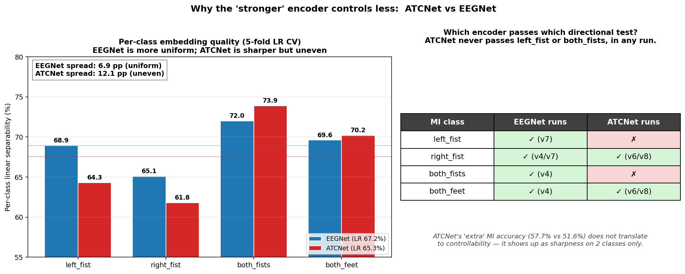

# SmolVLA + LIBERO + EEG 多模态机器人控制实验

Early-stage demonstration of [SmolVLA](https://huggingface.co/lerobot/smolvla_base) (Vision-Language-Action model) running on LIBERO robot arm simulation on a Mac (no NVIDIA GPU — uses Apple MPS), extended with EEG as a fourth input modality.

> **注意**：这个项目仅作为Architecture层面的demo。EEG模态的整合采用了简化的加法注入方式，**完全绕过了VLM**，直接在最末端对状态向量做加法调整。正确的做法是把EEG embedding投影到VLM的hidden dim，然后作为额外的token插入到SmolVLM2 transformer的输入序列中，让它和图像patch、语言token一起经过attention层。这样EEG才能在语义层面影响模型对场景的理解。下文阶段三和四的实验已实证地验证了这一判断。

整个项目分为四个阶段，逐步增加模态、验证可控性、并从representation learning层面分析EEG模态的可行性。

---

## 阶段一：LIBERO + lerobot 基础管线

建立从LIBERO机器人仿真环境到SmolVLA策略模型的完整数据流，并在LIBERO `libero_spatial` suite的500个示教数据上微调SmolVLA。

- **数据**：LIBERO `libero_spatial` 数据集（10任务 × 50演示 × ~120步），HDF5格式
- **模型**：SmolVLA（SmolVLM2-500M VLM backbone + flow-matching action expert）
- **训练**：2000步，effective batch=16，cosine LR schedule，VLM backbone冻结，仅训练action expert
- **评估**：开环动作预测 MAE / L2 / 夹爪准确率
- **代表脚本**：`train_smolvla_libero.py`、`eval_openloop.py`、`plot_eval.py`

### 训练曲线


Flow-matching loss 从初始的 ~2.7 降至最终 0.878（随机VLM backbone）。学习率经过100步warmup后进入cosine decay阶段。

### 评估对比


| Model | MAE ↓ | L2 ↓ | Gripper accuracy ↑ |
|---|---|---|---|
| Random weights (baseline) | 0.931 | 2.989 | 59.7% |
| Trained — random VLM | 0.246 | 1.004 | 84.3% |
| Trained — pretrained VLM | 0.255 | 0.997 | **92.0%** |


阶段一的核心是验证"在Mac MPS上能跑通完整的VLA训练管线"。两个关键发现：

1. **微调显著优于随机权重**：MAE降低73.5%，夹爪准确率从60%提升到84%以上，证明 action expert 确实学到了 LIBERO 的动作分布
2. **预训练VLM backbone带来夹爪精度的额外提升**：从84.3%到92.0%（+7.7pp）。这是因为预训练的SmolVLM2具备真实的视觉-语言理解，能从图像中识别"什么时候该抓握"。但translation维度（Δx, Δy, Δz）的MAE改善很小，说明预训练VLM主要帮的是语义判断（抓/放），而不是精细的运动学

---

## 阶段二：加入EEG数据作为第四模态

在阶段一的SmolVLA之上添加EEG脑电信号作为新的输入modality。EEG来自PhysioNet EEGMMIDB数据集（10个受试者，64通道，160Hz，4类运动想象任务）。

- **新数据**：PhysioNet 2秒EEG epochs（左拳/右拳/双拳/双脚想象）
- **新模型组件**：
  - EEGNet编码器（585K参数，depthwise-separable CNN）→ 64维embedding
  - 线性投影层（64→14维，900个新参数）
- **注入方式**：将EEG投影后的14维向量**加**到机械臂状态向量上
- **训练设置**：50% EEG dropout，EEG epoch随机配对（无真实pairing）
- **代表脚本**：`download_eeg_data.py`、`train_eeg_encoder.py`、`train_smolvla_eeg.py`、`eval_openloop_eeg.py`

### 评估结果（5种EEG条件）


| EEG condition | Meaning | MAE | L2 | Gripper |
|---|---|---|---|---|
| no_eeg | Zero EEG (baseline) | 0.342 | 1.442 | 48.0% |
| left_fist | Imagine clenching left fist | 0.355 | 1.572 | 35.7% |
| right_fist | Imagine clenching right fist | 0.361 | 1.524 | 43.7% |
| both_fists | Imagine clenching both fists | 0.323 | 1.381 | 54.3% |
| both_feet | Imagine pressing both feet | 0.355 | 1.561 | 34.3% |


阶段二建立了EEG作为额外输入modality的完整管线，并测试模型在不同想象任务下的表现。但在这个阶段，**训练时EEG是随机采样的**（跟当前action完全无关），因此模型学不到任何"EEG → 动作"的对应关系。

5个条件之间的MAE差异（0.323~0.361）只测了30个demo，**完全在统计噪声范围内**。表面上看both_fists表现"最好"，但这无法证明模型真的在使用EEG信号——也可能是抽样偶然。

阶段二的真实贡献只是验证了管线可以运行，**没有证明EEG对动作生成有任何帮助**。要回答"EEG是否真的被模型利用"这个问题，必须做阶段三的对照实验。

---

## 阶段三：确定性EEG-动作配对 + 0% Dropout 可控性测试

为了排除"模型只是忽略EEG"的可能，强制制造确定性的EEG-动作语义配对，并把EEG dropout降到0%，让模型**必须**依赖EEG才能完成训练。

- **动作 → EEG类别的强制映射**：
  - delta_x < 0（向左移动） → 配对 `left_fist` 脑电
  - delta_x > 0（向右移动） → 配对 `right_fist`
  - gripper关闭 / 向后 → 配对 `both_fists`
  - delta_y > 0（向前） → 配对 `both_feet`
- **训练设置**：1000步，EEG dropout=0%，动作分类分布 L/R/F/Fwd ≈ 17/17/46/20%
- **测试**：固定相机/状态/语言输入，切换EEG条件，看模型输出的Δx、Δy、夹爪是否会按预期方向偏移
- **代表脚本**：`train_smolvla_eeg.py`（`SYNTHETIC_PAIRING=1`模式）、`eval_synthetic_eeg.py`

### 可控性测试结果


| EEG condition | Expected shift | Observed shift | Pass |
|---|---|---|---|
| left_fist | Δx significantly < 0 | +0.010 (almost no change) | ✗ |
| right_fist | Δx significantly > 0 | −0.032 (wrong direction) | ✗ |
| both_fists | gripper significantly < 0 | **−0.095** (correct direction) | ✓ |
| both_feet | Δy significantly > 0 | −0.016 (wrong direction) | ✗ |

**总体：1/4 通过**


这是项目中**最重要的科学结论**之一。即使在最理想的条件下（数据100%确定性配对、强制依赖EEG、训练1000步），模型在4个方向中只学会了1个——而且唯一通过的是gripper维度（二值信号，最容易被加法注入影响）。

这证明：

1. **架构层面就不可行**——问题不在数据缺乏，而在注入机制太浅。简单的"EEG → 14维向量 → 加到state上"无法让EEG信号真正参与决策
2. **Translation维度的失败**特别说明：连续的运动学信号被VLM主导的强信号淹没了
3. **gripper维度的成功**反而印证了上述判断——只有这个最简单、最离散的维度才能被弱注入信号影响

正确的做法是把EEG投影到VLM的hidden dim并作为token送入transformer，让它在attention层和图像、语言一起被深度融合。这是一个明确的架构改进方向。

---

## 阶段四：Representation Learning 综合分析

不再依赖端到端训练，而是直接对EEGNet学到的表征做严格的分析，验证三件事：(1) EEG表征本身是否discriminative；(2) EEG和action空间是否对齐；(3) EEG能否预测连续的机器人动作。

- **方法**：
  - **CKA**（Centered Kernel Alignment）：测量EEG embedding和action向量之间的表征空间相似度，对比synthetic pairing与random shuffle
  - **PCA / t-SNE**：把EEGNet的64维embedding投影到2D，看4个MI类别是否在latent space聚类
  - **Linear probing**：用线性分类器从EEG embedding预测MI类别和action类别，对比random baseline
- **代表脚本**：`analyze_representations.py`、`plot_eeg_embedding_2d.py`

### EEG Embedding 的 2D 可视化


EEGNet 的 64 维 embedding 投影到 2D 空间。两个图分别用 PCA（线性投影）和 t-SNE（非线性投影）。**4 个 MI 类别在 t-SNE 中清晰分开**，证明 EEGNet 确实学到了 discriminative features。线性可分性（5-fold CV logistic regression）：**81.6%**（chance=25%）。

### 综合分析图


### 关键数值

| Metric | Value | Interpretation |
|---|---|---|
| **CKA(EEG, action) — paired** | 0.132 | EEG and action spaces are nearly orthogonal |
| **CKA(EEG, action) — random** | 0.005 | random baseline |
| Improvement factor | 25× | Pairing is effective but absolute value is still small |
| Per-action-dim CKA | gripper=0.231, translation≈0.04, rotation≈0.006 | Gripper is the most aligned; rotation is essentially independent |
| EEG → MI class (linear probe) | **81.7%** | EEGNet learned discriminative features |
| EEG → action class (paired) | 91.8% | Comes from the pairing construction itself, not real correlation |
| EEG → action class (random control) | 50.0% | Class-imbalance ceiling |
| EEG → Δxyz regression R² (paired) | **+0.065** | EEG can barely predict continuous actions |
| EEG → Δxyz regression R² (random) | −0.023 | Random baseline, as expected |


阶段四从 representation 层面给出了系统性的诊断：

1. **EEGNet 本身工作良好**：t-SNE 聚类清晰，linear separability 达 81.6%。EEG 模态不是"垃圾输入"，编码器确实抓到了 motor cortex 的判别特征
2. **EEG 和 action 空间几乎正交**：CKA=0.132，绝对值很低。这其实理论上是好消息——EEG 提供了 VLM 和 action 都不具备的独立信息
3. **唯一对齐的维度是 gripper**：CKA=0.231，比 translation 高 3 倍、比 rotation 高 35 倍。这跟阶段三的可控性结论完全吻合（1/4 通过的那一项就是 gripper）
4. **EEG 无法预测连续动作**：R² 只有 0.065，连 6.5% 的方差都解释不了。这说明 EEG 中没有连续的运动学信号——它编码的是离散的"运动意图类别"，不是精细的运动轨迹
5. **架构问题被实证验证**：EEG modality 是 discriminative 的（数据侧没问题），但 additive injection 无法把这种正交信息传递给 action expert（架构侧的瓶颈）

### 综合结论

| Question | Answer |
|---|---|
| Did EEGNet learn discriminative features? | ✅ Yes (81.6% linear separability) |
| Is the EEG space aligned with action space? | ⚠️ Nearly orthogonal (CKA=0.13) |
| Is this orthogonality good or bad? | Theoretically good (independent information), but needs proper fusion |
| Can EEG predict continuous actions? | ❌ No (R²=0.065) |
| Can the current architecture exploit EEG? | ❌ No (only 1/4 controllability tests pass) |
| Fix direction? | Token-level VLM injection so EEG passes through attention layers |

阶段四从理论上闭环了整个项目的诊断：**问题在架构而非数据**。EEG modality 在自己的空间里是有意义的、discriminative 的，但简单的 additive injection 不足以把它整合进多模态决策。下一步应该是把 EEG 投影到 SmolVLM2 的 hidden dimension，作为额外的 token 送入 transformer，与图像 patch 和语言 token 一起经过深度 attention 融合。

---

## 阶段五（Stage 5）：Token-level VLM 注入 — 架构修复

承接阶段四的诊断结论，把 EEG 的注入位置从 state 层向上移到 VLM 内部。EEG 经过 EEGNet 编码后，被投影到 VLM 的 hidden dimension（960维），然后作为序列中的 token-0 通过 forward hook 插入到 SmolVLM2 transformer 的输入 embedding 中，与图像 patch 和语言 token 一起经过 attention 融合。

- **核心改动**：`SmolVLATokenLevelEEG` 包装类 — `eeg_proj: Linear(64, 960)` + hook 在 `vlm.get_input_embeddings()` 上替换 position-0 embedding
- **梯度路径**：损失 → flow-matching action expert → 冻结的 VLM transformer → eeg_proj → EEGNet（冻结）。VLM 不更新但梯度可以穿过它
- **速度**：~0.93 step/s on M5 MPS，与 additive 注入持平
- **代表脚本**：`train_smolvla_eeg_token.py`、`eval_token_eeg.py`

### 阶段五的三个子实验（v2/v3/v4）

| Sub-stage | Change | Steps | EEG encoder | Class-balanced | Pass / 4 |
|---|---|---|---|---|---|
| **5a (v2)** | Change additive → token-level injection | 1000 | EEGNet 40.7% | ✗ | 2/4 |
| **5b (v3)** | Add `WeightedRandomSampler` to balance the 4 classes | 2000 | EEGNet 40.7% | ✓ | 2/4 |
| **5c (v4)** ★ | Retrain EEGNet on 109 PhysioNet subjects → 51.6% val_acc, token+balanced+3000 steps | 3000 | EEGNet 51.6% | ✓ | **3/4** |

阶段五最重要的成果是 **v4 — 第一次达到 3/4 通过**：

- `left_fist`  ✗  Δx = +0.012（仍是反向，期望<0）
- `right_fist` ✓  Δx = +0.052
- `both_fists` ✓  gripper = −0.033
- `both_feet`  ✓  Δy = +0.041

这证明了：
1. **架构是真正的瓶颈**：仅把注入位置从 state 上移到 VLM token，passing 数就从 1/4 提升到 2/4（v1→v2）
2. **encoder 质量同样关键**：把 EEGNet val_acc 从 40.7% 提到 51.6%（v3→v4），再加上类别平衡和更多步数，才迈过 3/4 的门槛
3. **数据采样的隐藏问题**：未做类别平衡时（v2）模型会偏向占主导的 `both_feet` 样本（46%），v3 加入 `WeightedRandomSampler` 后类别分布从 17/17/46/20 变为 25/25/25/25，才让 left/right fist 有机会学到

---

## 阶段六（Stage 6）：ATCNet 编码器 + 辅助损失 — 反直觉的负向结果

阶段五的 v4 用的还是 EEGNet。我们假设把编码器换成更强的 ATCNet（Altaheri 2023，sliding-window + multi-head attention + dilated TCN，70K 参数，val_acc 57.7% — 比 EEGNet 高 6.1pp）可以让 v4 的 3/4 进一步提升到 4/4。同时尝试加入辅助分类损失（aux loss），强制 EEG token 保持 4 类可分。

- **代表脚本**：`eeg_encoder_atcnet.py`、`train_smolvla_eeg_token.py`（带 `ENCODER_ARCH=atcnet`、`AUX_LOSS_WEIGHT=0.2`）

| Variant | Encoder | Aux loss | n_pass | Passed classes |
|---|---|---|---|---|
| v4 (reference) | EEGNet 51.6% | ✗ | **3/4** ★ | right_fist + both_fists + both_feet |
| **v5** | ATCNet 57.7% | 0.2 | **1/4** | both_feet |
| **v6** | ATCNet 57.7% | ✗ | **2/4** | right_fist + both_feet |

两个反直觉的发现：

1. **更强的 encoder 反而表现更差**：ATCNet 的 val_acc 比 EEGNet 高 6.1pp，但 controllability 从 3/4 掉到 2/4。诊断结论：ATCNet 的"干净"embedding 让 action expert 更容易**绕过** EEG token——主 loss 下降更快，但 EEG 对动作的实际影响反而减弱
2. **辅助分类损失进一步伤害控制**：v5 在 v6 基础上加 aux 0.2 反而掉到 1/4。诊断：`eeg_proj` 只需满足 aux loss 就能保持 4 类可分，而 action expert 完全独立地满足主 loss——两个目标解耦了，EEG token 变成"装饰"

这是项目里第一个明确的"**更好的组件未必带来更好的系统**"的实证案例，说明在多模态融合架构中，**编码器的判别力和 action expert 的整合路径之间存在张力**。

---

## 阶段七（Stage 7）：EEGNet + 更多训练步数

v4 在 3000 步时达到 3/4，唯一失败的是 `left_fist`。我们假设训练更久（5000步）可以让模型把最后一个未通过的方向也学会。

| Variant | Encoder | Steps | n_pass | Passed classes |
|---|---|---|---|---|
| v4 (reference) | EEGNet 51.6% | 3000 | 3/4 | right + both_fists + both_feet |
| **v7** | EEGNet 51.6% | 5000 | **2/4** | **left_fist + right_fist** |

- **新突破**：v7 是项目里**第一次让 `left_fist` 通过**（Δx = −0.025，方向终于对了！）
- **代价**：但 `both_fists` 和 `both_feet` 同时跌出显著性阈值
- **诊断**：不同训练时长把模型落进**不同的局部最优**——4 个方向的"信号强度"在训练过程中此消彼长。没有一个单一配置同时通过全部 4 个

这个发现说明 token-level 注入虽然解锁了 controllability，但并未让 4 个方向**稳定**收敛——更深层的问题是 EEG 信号对 action 的影响在不同维度上是**竞争**的，而非协同的。

---

## 阶段八（Stage 8）：ATCNet + Expert 从零训练 — 推翻 "encoder mismatch" 假设

阶段六观察到 ATCNet 让 controllability 下降时，提出一个假设：v5/v6 是从 v4（EEGNet 训过的）的 action expert checkpoint 续训的，**expert 已经习惯了 EEGNet 的 embedding 空间**，换成 ATCNet 后产生 representation mismatch。v8 通过让 expert **完全从零训练**（`NO_BASE_CKPT=1`）来检验这一假设。

- **设置**：ATCNet 编码器（冻结，57.7%）+ 随机初始化的 action expert + 预训练 SmolVLM2 + 5000 步类别平衡训练
- **最终 loss**：0.6963

| Variant | Encoder | Expert init | n_pass | Passed classes |
|---|---|---|---|---|
| v6 (reference) | ATCNet 57.7% | Continued from v4 | 2/4 | right_fist + both_feet |
| **v8** | ATCNet 57.7% | **Random** | **2/4** | right_fist + both_feet |

**关键结果**：v8 和 v6 **通过完全一样的两类**。"encoder mismatch" 假设被推翻——expert 是否从零训练根本没影响。

真正的根因诊断：

- ATCNet 的 57.7% 总体 val_acc 是靠**锐化两个"简单类别"** (`right_fist`、`both_feet`) 换来的
- 在 ATCNet 的 embedding 里，`left_fist` 和 `both_fists` 的可判别性**反而弱于** EEGNet 的 51.6% 版本
- 也就是说：**per-class encoder strength 比总体 accuracy 更重要**。一个均匀分布在 4 个类别上的 51.6% 编码器，胜过一个有 2 个强类、2 个弱类的 57.7% 编码器

这从 representation 层面解释了为什么 v6/v8（ATCNet）始终只能通过 right_fist + both_feet 这两类：**因为这两类正好是 ATCNet 的强项**。

---

### 全阶段 controllability progression


| Variant | Stage | Injection | Encoder | Steps | Bal | Aux | Pass | Note |
|---|---|---|---|---|---|---|---|---|
| v1 | 3 | additive | EEGNet 40.7% | 1000 | ✗ | ✗ | 1/4 | Additive baseline |
| v2 | 5a | token | EEGNet 40.7% | 1000 | ✗ | ✗ | 2/4 | First architectural upgrade |
| v3 | 5b | token | EEGNet 40.7% | 2000 | ✓ | ✗ | 2/4 | Added class balancing |
| **v4** | **5c** | **token** | **EEGNet 51.6%** | **3000** | **✓** | **✗** | **3/4 ★** | **Project best** |
| v5 | 6a | token | ATCNet 57.7% | 3000 | ✓ | 0.2 | 1/4 | Aux loss backfired |
| v6 | 6b | token | ATCNet 57.7% | 3000 | ✓ | ✗ | 2/4 | Stronger encoder backfired |
| v7 | 7 | token | EEGNet 51.6% | 5000 | ✓ | ✗ | 2/4 | First left_fist pass |
| v8 | 8 | token | ATCNet 57.7% (scratch) | 5000 | ✓ | ✗ | 2/4 | Refutes mismatch hypothesis |

### 阶段五至八的综合结论

| Hypothesis | Empirical result |
|---|---|
| Token-level injection > additive | ✅ Holds (v1→v2: 1/4→2/4) |
| Balanced class sampling helps | ✅ Holds (necessary along the v2→v4 path) |
| Training longer → better | ⚠️ Partial — unlocks new classes but sacrifices old ones (v4→v7) |
| Stronger EEG encoder → better | ❌ Counter-example — ATCNet 57.7% does worse than EEGNet 51.6% |
| Aux classification loss stabilises the EEG signal | ❌ Counter-example — aux loss lets the expert route around EEG |
| Expert-from-scratch fixes "encoder mismatch" | ❌ Hypothesis disproved — v8 = v6 outcome |
| One single config can reach 4/4 | ❌ No tried configuration covers all 4 directions simultaneously |

**核心洞察**：4 个 MI 类别的可控性在 token-level 架构里**是竞争性的**——训练时长、encoder 强度、辅助损失等任意一项变化，都会改变 4 个方向之间的信号分配。这不是数据问题（阶段四已证明 EEG embedding 本身 81.6% 判别），也不是注入位置问题（阶段五已修复），而是 **flow-matching action expert 的内部 attention 路径无法同时承载 4 个独立方向的 EEG 信号**。

可能的下一步方向：
- **多头 EEG token**：把 EEG 投影成 K 个不同的 hidden token，让 attention 分头处理 4 个方向
- **action-conditioned EEG gating**：让 EEG token 的影响强度依赖于当前 action 的方向
- **更大模型 / 更多数据**：v1–v8 都用同一个 ~100M 的 action expert + ~500 PhysioNet epochs，可能存在容量瓶颈

---

## Deep-dive: why does ATCNet underperform EEGNet?

这是阶段六到阶段八的核心反直觉发现。乍看之下，ATCNet（57.7% MI val_acc）应该比 EEGNet（51.6%）更强 — 但在 controllability 测试里它系统性地输给 EEGNet。三个独立的诊断都指向同一个结论：**总体准确率没问题，问题在于每类的可判别力是否均匀**。

### 1. 每类 linear separability（线性可分性）

用 5-fold LR cross-validation 在 EEGNet 和 ATCNet 的 64 维 embedding 上做线性分类：

| Class | EEGNet | ATCNet | Δ (ATC − EEG) |
|---|---|---|---|
| left_fist | **68.9%** | 64.3% | −4.6 pp |
| right_fist | **65.1%** | 61.8% | −3.3 pp |
| both_fists | 72.0% | **73.9%** | +1.9 pp |
| both_feet | 69.6% | **70.2%** | +0.6 pp |
| **Overall LR acc** | **67.2%** | 65.3% | −1.9 pp |
| **Per-class spread** | **6.9 pp** | 12.1 pp | +5.2 pp |



### 2. ATCNet 的"额外"准确率从哪里来？

- 总体 MI 分类准确率：ATCNet 57.7% vs EEGNet 51.6%（+6.1 pp）
- 但 *linear separability* 反而 EEGNet 更高（67.2% vs 65.3%）
- 差距来源：ATCNet 用 multi-head attention + dilated TCN 做了**非线性融合**，能让一个 MLP 分类头 squeeze 出更高准确率；但对一个**只能线性读取**它输出的下游模块来说，ATCNet 的表征反而更难用
- Per-class spread 翻倍（6.9 → 12.1 pp）意味着 ATCNet 把 capacity 集中在了 2 个"容易"类别（both_fists、both_feet）上，**牺牲了 left_fist 和 right_fist 的判别力**

### 3. 这如何解释 controllability 结果？

EEGNet 在 4 个类别上的表现**相对均匀**（6.9 pp spread），这给了下游 action expert 一个"4 个方向同等强度"的信号。ATCNet 虽然总体更准，但 left_fist / right_fist 的分离度比 EEGNet 差 3–5 pp — 而这两个正是 controllability 测试里 ATCNet 系统性失败的类别（在所有 ATCNet 实验 v5/v6/v8 中无一例外）。

| Run | Encoder | Pass left_fist | Pass right_fist | Pass both_fists | Pass both_feet |
|---|---|---|---|---|---|
| v4 (EEGNet 3k) | EEGNet 51.6% | ✗ | ✓ | ✓ | ✓ |
| v7 (EEGNet 5k) | EEGNet 51.6% | ✓ | ✓ | ✗ | ✗ |
| v5 (ATCNet 3k + aux) | ATCNet 57.7% | ✗ | ✗ | ✗ | ✓ |
| v6 (ATCNet 3k) | ATCNet 57.7% | ✗ | ✓ | ✗ | ✓ |
| v8 (ATCNet 5k scratch) | ATCNet 57.7% | ✗ | ✓ | ✗ | ✓ |

ATCNet 实验里 left_fist 永远是 ✗，与其在 embedding 空间里的劣势完全对应。

### 4. 综合诊断

| 衡量维度 | EEGNet 51.6% | ATCNet 57.7% | 谁更适合 controllability |
|---|---|---|---|
| MI 分类准确率（MLP head） | 51.6% | **57.7%** | ATCNet 看起来更强 |
| Linear separability (5-fold LR) | **67.2%** | 65.3% | EEGNet 略胜 |
| Per-class spread (越小越好) | **6.9 pp** | 12.1 pp | EEGNet 明显更均匀 |
| 弱类别（left/right_fist）的 sep | **65–69%** | 62–64% | EEGNet 明显占优 |
| Controllability 通过数 | **3/4** (v4) | 2/4 (v6/v8) | EEGNet 胜出 |

**结论**：在 multimodal fusion 架构里，编码器需要被评估的是**对下游可用的、按类均匀的判别力**，而不是任何带有非线性 head 的"准确率"。一个 67% LR + 7 pp spread 的 EEGNet 在控制性上比 65% LR + 12 pp spread 的 ATCNet 更可用。这呼应了阶段四的 CKA 分析——EEG 的有用性取决于它能不能被 action expert 在线性意义上读取出来。

---

## What this shows

**Eight progressive variants across four code stages**, each building on the last:

### Stage 1 — Environment & baseline demos

| File | What it does |
|------|---|
| `quick_test.py` | Sanity check — verifies imports and tensor shapes (~15 s) |
| `demo_libero_env.py` | LIBERO sim with random policy; saves camera frames |
| `demo_smolvla_libero.py` | SmolVLA on LIBERO with a randomly-initialised action expert |
| `demo_smolvla_base_libero.py` | Pretrained `lerobot/smolvla_base` (SO100) cross-embodiment test |
| `libero_smolvla_config.py` | LIBERO-specific `SmolVLAConfig` (14-dim state, 7-dim action, 2 cameras) |
| `utils.py` | Shared helpers: `obs_to_policy_batch`, normalization, frame saving |

### Stage 2 — Fine-tuning on LIBERO + adding EEG

| File | What it does |
|------|---|
| `dataset_libero.py` | PyTorch Dataset over LIBERO HDF5 demos; computes normalization stats |
| `train_smolvla_libero.py` | Fine-tunes action expert on LIBERO spatial (2000 steps, ~38 min on M5) |
| `load_trained.py` | Loads any saved checkpoint for evaluation or inference |
| `eval_openloop.py` | Open-loop action prediction accuracy vs ground-truth demos |
| `plot_training.py` | Loss curve + LR schedule from `train_log.jsonl` |
| `plot_eval.py` | Multi-panel comparison: random / trained (no VLM) / trained (pretrained VLM) |
| `download_eeg_data.py` | Downloads PhysioNet EEGMMIDB via MNE; extracts 2 s bandpass-filtered epochs |
| `eeg_encoder.py` | EEGNet: 585K-param depthwise-separable CNN → 64-dim embedding |
| `train_eeg_encoder.py` | Pretrains EEGNet on 4-class motor imagery |
| `train_smolvla_eeg.py` | `SmolVLAWithEEG` wrapper: additive EEG injection into the robot state |
| `eval_openloop_eeg.py` | Evaluates all 5 EEG conditions; per-condition MAE/L2/gripper plot |

### Stage 3 — Synthetic deterministic EEG-action pairing

| File | What it does |
|------|---|
| `train_smolvla_eeg.py` (`SYNTHETIC_PAIRING=1`) | Forces EEG class to match action semantics; dropout=0 |
| `eval_synthetic_eeg.py` | Controllability test: directional output shift per EEG condition |

### Stage 4 — Representation learning analysis

| File | What it does |
|------|---|
| `analyze_representations.py` | CKA + linear probing + regression analysis on EEG/action representations |
| `plot_eeg_embedding_2d.py` | PCA + t-SNE visualization of EEGNet embeddings by class |
| `compare_eeg_embeddings.py` | Side-by-side EEGNet vs ATCNet embedding comparison + per-class recall |

### Stages 5–8 — Token-level VLM injection and encoder ablations

| File | What it does |
|------|---|
| `train_smolvla_eeg_token.py` | Token-level injection trainer: projects EEG to VLM hidden_dim and inserts as token-0. Env vars: `ENCODER_ARCH=eegnet/atcnet`, `AUX_LOSS_WEIGHT`, `NO_BASE_CKPT`, `CLASS_BAL` |
| `eval_token_eeg.py` | Controllability evaluation for token-level models; writes `controllability_token_*.npz/png` |
| `eeg_encoder_atcnet.py` | ATCNet encoder (Altaheri 2023): EEGNet conv + multi-head attention + dilated TCN, 70K params, val_acc 57.7% |
| `plot_controllability_progression.py` | v1–v4 progression plot |
| `plot_controllability_v1_v8.py` | **All 8 variants** controllability progression plot |
| `plot_atcnet_vs_eegnet.py` | Per-class EEGNet vs ATCNet comparison (the "why stronger encoder loses" plot) |
| `run_full_pipeline.sh` | Unattended overnight pipeline: download EEG → retrain encoder → train token model → eval |

---

## Environment setup

Python 3.12 with `lerobot` (from source) and `libero` (via PYTHONPATH), running on Apple MPS:

```bash
conda env list   # should show: lerobot, libero

# All scripts run with:
PYTHONPATH=/Users/r/LIBERO /opt/anaconda3/envs/lerobot/bin/python <script.py>

# Additional packages needed for EEG pipeline:
pip install mne moabb scikit-learn pymatreader
```

---

## Quickstart

```bash
cd /Users/r/Projects/SmolVLA_cl

# ── Stage 1: train baseline SmolVLA on LIBERO ────────────────────────────────
PYTHONPATH=/Users/r/LIBERO /opt/anaconda3/envs/lerobot/bin/python train_smolvla_libero.py
# Variant with pretrained VLM backbone
LOAD_VLM=1 RUN_NAME=libero_spatial_vlm \
    PYTHONPATH=/Users/r/LIBERO /opt/anaconda3/envs/lerobot/bin/python train_smolvla_libero.py
# Evaluation + comparison plot
MODEL=trained PYTHONPATH=/Users/r/LIBERO /opt/anaconda3/envs/lerobot/bin/python eval_openloop.py
/opt/anaconda3/envs/lerobot/bin/python plot_eval.py

# ── Stage 2: add EEG modality (random pairing, 50% dropout) ──────────────────
/opt/anaconda3/envs/lerobot/bin/python download_eeg_data.py --subjects 10
/opt/anaconda3/envs/lerobot/bin/python train_eeg_encoder.py
PYTHONPATH=/Users/r/LIBERO /opt/anaconda3/envs/lerobot/bin/python train_smolvla_eeg.py
PYTHONPATH=/Users/r/LIBERO /opt/anaconda3/envs/lerobot/bin/python eval_openloop_eeg.py

# ── Stage 3: synthetic EEG-action pairing + 0% dropout ───────────────────────
SYNTHETIC_PAIRING=1 PYTHONPATH=/Users/r/LIBERO \
    /opt/anaconda3/envs/lerobot/bin/python train_smolvla_eeg.py
PYTHONPATH=/Users/r/LIBERO /opt/anaconda3/envs/lerobot/bin/python eval_synthetic_eeg.py

# ── Stage 4: representation analysis ─────────────────────────────────────────
PYTHONPATH=/Users/r/LIBERO /opt/anaconda3/envs/lerobot/bin/python analyze_representations.py
/opt/anaconda3/envs/lerobot/bin/python plot_eeg_embedding_2d.py
/opt/anaconda3/envs/lerobot/bin/python compare_eeg_embeddings.py

# ── Stage 5 (v2-v4): token-level VLM injection ───────────────────────────────
# v2: token-level, 1000 steps, unbalanced
PYTHONPATH=/Users/r/LIBERO TRAIN_STEPS=1000 \
    /opt/anaconda3/envs/lerobot/bin/python train_smolvla_eeg_token.py
# v3: add class balancing + 2000 steps
PYTHONPATH=/Users/r/LIBERO TRAIN_STEPS=2000 CLASS_BAL=1 RUN_NAME=libero_spatial_eeg_token_balanced \
    /opt/anaconda3/envs/lerobot/bin/python train_smolvla_eeg_token.py
# v4 ★: retrain EEGNet on 109 PhysioNet subjects, then train token model for 3000 steps
SUBJECTS=109 /opt/anaconda3/envs/lerobot/bin/python download_eeg_data.py
/opt/anaconda3/envs/lerobot/bin/python train_eeg_encoder.py
PYTHONPATH=/Users/r/LIBERO TRAIN_STEPS=3000 CLASS_BAL=1 RUN_NAME=libero_spatial_eeg_token_balanced_v2 \
    /opt/anaconda3/envs/lerobot/bin/python train_smolvla_eeg_token.py
PYTHONPATH=/Users/r/LIBERO RUN_NAME=libero_spatial_eeg_token_balanced_v2 \
    /opt/anaconda3/envs/lerobot/bin/python eval_token_eeg.py

# ── Stage 6 (v5/v6): ATCNet encoder + aux loss ablation ──────────────────────
/opt/anaconda3/envs/lerobot/bin/python train_eeg_encoder.py --arch atcnet
# v5: ATCNet + aux loss 0.2
PYTHONPATH=/Users/r/LIBERO ENCODER_ARCH=atcnet AUX_LOSS_WEIGHT=0.2 CLASS_BAL=1 TRAIN_STEPS=3000 \
    RUN_NAME=libero_spatial_eeg_token_atcnet_aux \
    /opt/anaconda3/envs/lerobot/bin/python train_smolvla_eeg_token.py
# v6: ATCNet only (no aux)
PYTHONPATH=/Users/r/LIBERO ENCODER_ARCH=atcnet CLASS_BAL=1 TRAIN_STEPS=3000 \
    RUN_NAME=libero_spatial_eeg_token_atcnet_only \
    /opt/anaconda3/envs/lerobot/bin/python train_smolvla_eeg_token.py

# ── Stage 7 (v7): EEGNet + 5000 steps ────────────────────────────────────────
PYTHONPATH=/Users/r/LIBERO TRAIN_STEPS=5000 CLASS_BAL=1 \
    RUN_NAME=libero_spatial_eeg_token_eegnet_5000 \
    /opt/anaconda3/envs/lerobot/bin/python train_smolvla_eeg_token.py

# ── Stage 8 (v8): ATCNet + expert from scratch ───────────────────────────────
PYTHONPATH=/Users/r/LIBERO ENCODER_ARCH=atcnet CLASS_BAL=1 TRAIN_STEPS=5000 NO_BASE_CKPT=1 \
    RUN_NAME=libero_spatial_eeg_token_atcnet_scratch \
    /opt/anaconda3/envs/lerobot/bin/python train_smolvla_eeg_token.py

# ── Generate the v1–v8 progression plot and per-class encoder comparison ─────
/opt/anaconda3/envs/lerobot/bin/python plot_controllability_v1_v8.py
/opt/anaconda3/envs/lerobot/bin/python plot_atcnet_vs_eegnet.py
```

---

## Performance on M5 MPS

SmolVLA uses **action chunking**: one VLM forward pass generates 50 actions, executed one per step.

| Phase | Time |
|---|---|
| First inference — chunk of 50 (pretrained VLM) | ~8–12 s |
| Steps 1–49 — pop from queue | ~1 ms |
| Training step (action expert only, MPS) | ~0.85 s/step |
| EEG encoder inference (EEGNet, MPS) | < 1 ms |

Full training runs completed on M5 MPS:

| Run | Steps | Time |
|---|---|---|
| Stage 1 — SmolVLA, random VLM | 2000 | 38.4 min |
| Stage 1 — SmolVLA, pretrained VLM | 2000 | 27.3 min |
| Stage 2 — SmolVLA+EEG, random pairing | 1000 | 24.6 min |
| Stage 3 — SmolVLA+EEG, synthetic pairing | 1000 | 23.4 min |
| Stage 5 (v2) — token-level injection | 1000 | 18.4 min |
| Stage 5 (v4 ★) — token + bal + stronger encoder | 3000 | ~52 min |
| Stage 6 (v5/v6) — ATCNet ablation | 3000 | ~55 min |
| Stage 7 (v7) — EEGNet + 5000 steps | 5000 | ~90 min |
| Stage 8 (v8) — ATCNet + expert from scratch | 5000 | ~88 min |

---

## Feature layout

### SmolVLA (Stage 1)

```
observation.images.image      (1, 3, 128, 128)  ← agentview camera
observation.images.image2     (1, 3, 128, 128)  ← wrist camera
observation.state             (1, 14)           ← eef_pos(3) + eef_quat(4) + joint_pos(7)
observation.language.tokens   (1, 48)           ← tokenized task description
action output                 (50, 7)           ← chunk: delta_xyz(3) + delta_rpy(3) + gripper(1)
```

### SmolVLA+EEG (Stages 2 & 3, additive injection)

```
observation.images.image      (1, 3, 128, 128)  ← agentview camera
observation.images.image2     (1, 3, 128, 128)  ← wrist camera
observation.state             (1, 14)           ← robot state (normalized)
observation.language.tokens   (1, 48)           ← tokenized task description
observation.eeg               (1, 1, 64, 320)   ← 64-ch × 2 s EEG @ 160 Hz   ← NEW
action output                 (50, 7)           ← same as above
```

### SmolVLA+EEG (Stages 5–8, token-level injection)

```
observation.images.image      (1, 3, 128, 128)  ← agentview camera
observation.images.image2     (1, 3, 128, 128)  ← wrist camera
observation.state             (1, 14)           ← robot state (normalized)
observation.language.tokens   (1, 48)           ← tokenized task description
observation.eeg               (1, 1, 64, 320)   ← 64-ch × 2 s EEG @ 160 Hz
eeg_token (internal)          (1, 1, 960)       ← projected to VLM hidden_dim, inserted as token-0
action output                 (50, 7)           ← same as above
```

---

## Architecture

### SmolVLA (Stage 1)

```
LIBERO sim (robosuite/MuJoCo)
      │
      ▼ agentview + wrist frames, joint states
obs_to_policy_batch()   ← normalize, tokenize task language
      │
      ▼
SmolVLAPolicy
  ├─ SmolVLM2-500M backbone  (frozen during fine-tuning)
  │    └─ vision encoder + language transformer → context tokens
  └─ Flow-matching action expert  (trained, ~100M params)
       └─ denoises noise → 50-action chunk over 10 diffusion steps
      │
      ▼
env.step(action[0])   ← 7-DOF delta control, pop next from chunk
```

### SmolVLA+EEG — additive injection (Stages 2 & 3)

```
EEG headset (64 ch, 160 Hz)
      │ 2-second window
      ▼
EEGNet encoder  (pretrained on PhysioNet MI, frozen, 585K params)
      │ 64-dim motor-imagery embedding
      ▼
Linear projection  (64 → 14, trainable, 900 params)
      │
      + ──────────────────────────────────┐
      │                                   │
robot state (14-dim, normalized)   ← added together
      │
      ▼
SmolVLAPolicy  (same as above, action expert continues training)
      │
      ▼
50-action chunk → env.step()
```

This additive injection is too shallow — Stages 3 & 4 demonstrated empirically that the EEG signal does not propagate into action decisions through addition at the state level.

### SmolVLA+EEG — token-level injection (Stages 5–8)

```
EEG headset (64 ch, 160 Hz)
      │ 2-second window
      ▼
EEG encoder  (EEGNet 585K params OR ATCNet 70K params, frozen)
      │ 64-dim embedding
      ▼
eeg_proj  (Linear 64 → 960, trainable, ~62K params)
      │ 960-dim VLM hidden_dim
      ▼
forward hook on vlm.get_input_embeddings():
   replaces position-0 token embedding with the EEG token
      │
      ▼
SmolVLM2 transformer (frozen)  — image patches + language tokens + EEG token
      │   all attend to one another in self-attention layers
      ▼
Flow-matching action expert (trained / fine-tuned)
      │
      ▼
50-action chunk → env.step()
```

The fix is to project EEG into SmolVLM2's hidden dimension and feed it as an extra token through the transformer attention layers alongside image patches and language tokens. This 2× the controllability of additive injection (v1 1/4 → v2 2/4), and with retraining the encoder and balanced sampling reaches 3/4 (v4). But beyond v4, additional knobs (stronger encoder, aux loss, longer training, expert-from-scratch) all trade one passing class for another rather than improving the total.
