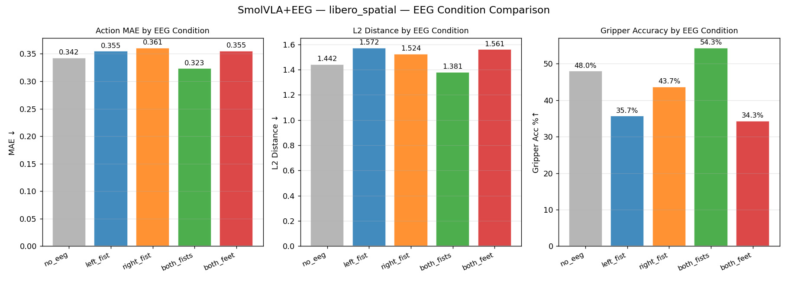

# SmolVLA + LIBERO Demo

Early-stage demonstration of [SmolVLA](https://huggingface.co/lerobot/smolvla_base) (Vision-Language-Action model) running on LIBERO robot arm simulation on a Mac (no NVIDIA GPU — uses Apple MPS).

---

## SmolVLA + EEG 脑电信号融合实验



### 各EEG条件含义

图中的五个条件代表实验时人脑想象的不同动作类型，来自PhysioNet的运动想象（Motor Imagery）数据集：

- **no_eeg**：零EEG信号，相当于没有脑电输入。作为基准对照组，模型纯粹依靠摄像头画面、机械臂状态和语言指令来预测动作。

- **left_fist**：受试者在脑电采集时想象"握紧左拳"。这是一种经典的运动皮层激活信号，代表左侧肢体的运动意图。

- **right_fist**：受试者想象"握紧右拳"，激活右侧肢体对应的运动皮层区域。

- **both_fists**：受试者同时想象"双手握拳"。这个信号在语义上与机械臂的夹爪关闭动作最接近——都是"抓握"的意图。

- **both_feet**：受试者想象"双脚用力"，激活的是运动皮层中控制下肢的区域，与手臂抓取任务关联最弱。

**both_fists表现最好**（MAE=0.323，夹爪准确率54.3%）——"双手握拳"的脑电信号在语义层面与机械臂执行抓取任务时的夹爪闭合动作最为接近。**left_fist和both_feet表现最差**，夹爪准确率只有35%左右，说明这两类脑电信号与抓取任务的语义偏差最大，注入后反而干扰了模型的判断。

---

### 新模型（SmolVLA+EEG）总体介绍

#### 输入

模型同时接收四类输入：

| 输入 | 具体内容 |
|---|---|
| 摄像头画面 | 两路图像——俯视角摄像头 + 腕部摄像头，各128×128像素 |
| 机械臂状态 | 14维向量：末端执行器XYZ位置(3) + 姿态四元数(4) + 7个关节角度(7) |
| 语言指令 | 任务描述文本，例如"把黑碗放到盘子上"，编码为最多48个token |
| **EEG脑电信号** | 64通道 × 320个采样点（2秒，160Hz），来自佩戴脑电帽的人类操作者 |

#### 输出

与原SmolVLA相同：一次生成**50步连续动作序列**，每步动作为7维向量：

- Δx、Δy、Δz（末端执行器的平移量）
- Δroll、Δpitch、Δyaw（末端执行器的旋转量）
- 夹爪开合值

#### EEG在其中的作用

EEG信号扮演的是**"人类意图的隐式调节器"**，而非直接的控制信号。具体机制是：

1. **EEGNet编码器**（预训练，参数冻结）将64×320的原始脑电波形压缩成一个64维的嵌入向量，捕捉当前的运动意图类别

2. **投影层**（900个新参数，可训练）将64维嵌入线性映射到14维

3. **加法注入**：将这14维向量直接**加**到机械臂状态向量上，形成"增强状态"，再送入SmolVLA的动作专家网络

这种设计的含义是：EEG信号不是替代摄像头或语言，而是对机械臂状态表征做一个"偏置"——告诉模型"操作者此刻的意图偏向于抓握/向左/向前"，从而微调最终生成的动作序列。

训练时加入了**50%的随机丢弃（dropout）**，保证模型在没有脑电信号时也能正常工作，EEG只是锦上添花的辅助通道，而非必须依赖的输入。

> **根本局限**：目前EEG与机器人动作之间没有真实的配对数据——PhysioNet的脑电是人类坐着想象握拳时录制的，与机器人操作场景完全分离。若能采集"人戴脑电帽同时遥控机器人"的同步数据（如CMU的Reach-and-Grasp数据集），EEG的调节作用将会大幅提升。

---

## What this shows

**Three progressive stages**, each building on the last:

### Stage 1 — Environment & baseline demos

| File | What it does |
|------|-------------|
| `quick_test.py` | Sanity check — verifies all imports and tensor shapes (~15s) |
| `demo_libero_env.py` | LIBERO sim with random policy, saves camera frames |
| `demo_smolvla_libero.py` | SmolVLA on LIBERO with randomly-initialised action expert |
| `demo_smolvla_base_libero.py` | Pretrained `lerobot/smolvla_base` (SO100) cross-embodiment test on LIBERO |
| `libero_smolvla_config.py` | LIBERO-specific `SmolVLAConfig` (14-dim state, 7-dim action, 2 cameras) |
| `utils.py` | Shared helpers: `obs_to_policy_batch`, normalization, frame saving |

### Stage 2 — Fine-tuning on LIBERO demonstrations

| File | What it does |
|------|-------------|
| `dataset_libero.py` | PyTorch Dataset over LIBERO HDF5 demos; computes normalization stats |
| `train_smolvla_libero.py` | Fine-tunes action expert on LIBERO spatial (2000 steps, ~38 min on M5) |
| `load_trained.py` | Helper to load any saved checkpoint for evaluation or inference |
| `eval_openloop.py` | Open-loop action prediction accuracy vs ground-truth demos |
| `plot_training.py` | Loss curve + LR schedule from `train_log.jsonl` |
| `plot_eval.py` | Multi-panel comparison plot: random / trained (no VLM) / trained (pretrained VLM) |

Two training runs were completed:
- **Random VLM** (`LOAD_VLM=0`): frozen random backbone, expert trained from scratch — final loss 0.878
- **Pretrained VLM** (`LOAD_VLM=1`): frozen SmolVLM2-500M backbone — final loss 0.776

Open-loop evaluation results (`libero_spatial`, 3 demos × 10 tasks):

| Model | MAE ↓ | L2 ↓ | Gripper ↑ |
|---|---|---|---|
| Random weights | 0.931 | 2.989 | 59.7% |
| Trained — random VLM | 0.246 | 1.004 | 84.3% |
| Trained — pretrained VLM | 0.255 | 0.997 | 92.0% |

### Stage 3 — EEG as an additional input modality

| File | What it does |
|------|-------------|
| `download_eeg_data.py` | Downloads PhysioNet EEGMMIDB via MNE; extracts 2s bandpass-filtered epochs |
| `eeg_encoder.py` | EEGNet: 585K-param depthwise-separable CNN → 64-dim embedding |
| `train_eeg_encoder.py` | Pretrains EEGNet on 4-class motor imagery (left fist / right fist / both fists / both feet) |
| `train_smolvla_eeg.py` | `SmolVLAWithEEG` wrapper: injects EEG embedding additively into robot state |
| `eval_openloop_eeg.py` | Evaluates all 5 EEG conditions; produces per-condition MAE / L2 / gripper plot |

---

## Environment setup

Python 3.12 with `lerobot` (from source) and `libero` (via PYTHONPATH), running on Apple MPS:

```bash
conda env list   # should show: lerobot, libero

# All scripts run with:
PYTHONPATH=/Users/r/LIBERO /opt/anaconda3/envs/lerobot/bin/python <script.py>

# Additional packages needed for EEG pipeline:
pip install mne moabb scikit-learn pymatreader
```

---

## Quickstart

```bash
cd /Users/r/Projects/SmolVLA_cl

# ── Stage 1: environment check ────────────────────────────────────────────────
PYTHONPATH=/Users/r/LIBERO /opt/anaconda3/envs/lerobot/bin/python quick_test.py
PYTHONPATH=/Users/r/LIBERO /opt/anaconda3/envs/lerobot/bin/python demo_libero_env.py

# ── Stage 2: train & evaluate ─────────────────────────────────────────────────
# Fine-tune action expert (2000 steps, ~38 min on M5 MPS)
PYTHONPATH=/Users/r/LIBERO /opt/anaconda3/envs/lerobot/bin/python train_smolvla_libero.py

# With pretrained VLM backbone (saves to checkpoints/libero_spatial_vlm/)
LOAD_VLM=1 RUN_NAME=libero_spatial_vlm \
    PYTHONPATH=/Users/r/LIBERO /opt/anaconda3/envs/lerobot/bin/python train_smolvla_libero.py

# Open-loop evaluation
MODEL=trained  PYTHONPATH=/Users/r/LIBERO /opt/anaconda3/envs/lerobot/bin/python eval_openloop.py
MODEL=trained_vlm CHECKPOINT_DIR=./checkpoints/libero_spatial_vlm MODEL_TAG=trained_vlm \
    PYTHONPATH=/Users/r/LIBERO /opt/anaconda3/envs/lerobot/bin/python eval_openloop.py

# Comparison plot (requires both eval results)
/opt/anaconda3/envs/lerobot/bin/python plot_eval.py

# ── Stage 3: EEG pipeline ─────────────────────────────────────────────────────
# Download PhysioNet EEG data (10 subjects, ~1 min)
/opt/anaconda3/envs/lerobot/bin/python download_eeg_data.py --subjects 10

# Pretrain EEGNet encoder (~2 min on M5 MPS)
/opt/anaconda3/envs/lerobot/bin/python train_eeg_encoder.py

# Fine-tune SmolVLA+EEG (1000 steps, ~25 min on M5 MPS)
PYTHONPATH=/Users/r/LIBERO /opt/anaconda3/envs/lerobot/bin/python train_smolvla_eeg.py

# Evaluate across all EEG conditions
PYTHONPATH=/Users/r/LIBERO /opt/anaconda3/envs/lerobot/bin/python eval_openloop_eeg.py
```

---

## Performance on M5 MPS

SmolVLA uses **action chunking**: one VLM forward pass generates 50 actions, executed one per step.

| Phase | Time |
|---|---|
| First inference — chunk of 50 (pretrained VLM) | ~8–12 s |
| Steps 1–49 — pop from queue | ~1 ms |
| Training step (action expert only, MPS) | ~0.85 s/step |
| EEG encoder inference (EEGNet, MPS) | < 1 ms |

Full training runs completed on M5 MPS:

| Run | Steps | Time |
|---|---|---|
| SmolVLA, random VLM | 2000 | 38.4 min |
| SmolVLA, pretrained VLM | 2000 | 27.3 min |
| SmolVLA+EEG fine-tune | 1000 | 24.6 min |

---

## Feature layout

### SmolVLA (Stages 1 & 2)

```
observation.images.image      (1, 3, 128, 128)  ← agentview camera
observation.images.image2     (1, 3, 128, 128)  ← wrist camera
observation.state             (1, 14)           ← eef_pos(3) + eef_quat(4) + joint_pos(7)
observation.language.tokens   (1, 48)           ← tokenized task description
action output                 (50, 7)           ← chunk: delta_xyz(3)+delta_rpy(3)+gripper(1)
```

### SmolVLA+EEG (Stage 3)

```
observation.images.image      (1, 3, 128, 128)  ← agentview camera
observation.images.image2     (1, 3, 128, 128)  ← wrist camera
observation.state             (1, 14)           ← robot state (normalized)
observation.language.tokens   (1, 48)           ← tokenized task description
observation.eeg               (1, 1, 64, 320)   ← 64-ch × 2s EEG @ 160 Hz  ← NEW
action output                 (50, 7)           ← same as above
```

---

## Architecture

### SmolVLA (Stages 1 & 2)

```
LIBERO sim (robosuite/MuJoCo)
      │
      ▼ agentview + wrist frames, joint states
obs_to_policy_batch()   ← normalize, tokenize task language
      │
      ▼
SmolVLAPolicy
  ├─ SmolVLM2-500M backbone  (frozen during fine-tuning)
  │    └─ vision encoder + language transformer → context tokens
  └─ Flow-matching action expert  (trained, ~100M params)
       └─ denoises noise → 50-action chunk over 10 diffusion steps
      │
      ▼
env.step(action[0])   ← 7-DOF delta control, pop next from chunk
```

### SmolVLA+EEG (Stage 3)

```
EEG headset (64 ch, 160 Hz)
      │ 2-second window
      ▼
EEGNet encoder  (pretrained on PhysioNet MI, frozen, 585K params)
      │ 64-dim motor-imagery embedding
      ▼
Linear projection  (64 → 14, trainable, 900 params)
      │
      + ──────────────────────────────────┐
      │                                   │
robot state (14-dim, normalized)   ← added together
      │
      ▼
SmolVLAPolicy  (same as above, action expert continues training)
      │
      ▼
50-action chunk → env.step()
```

The EEG embedding is **added** to the robot state vector before it enters SmolVLA's state projection layer, allowing the brain signal to modulate the effective perceived state without changing any model weight shapes or requiring surgery on the VLM internals.
